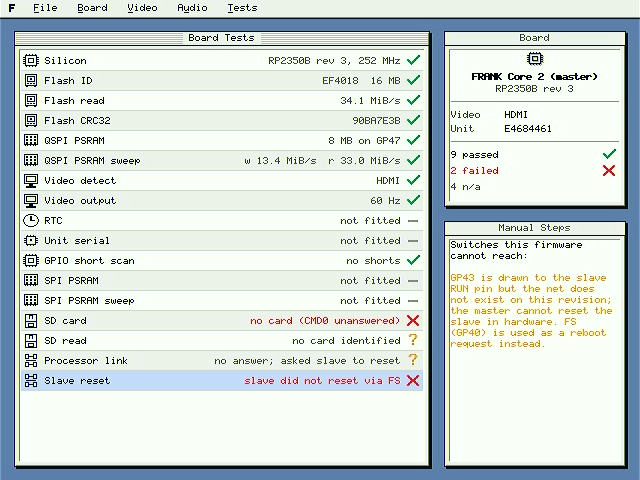
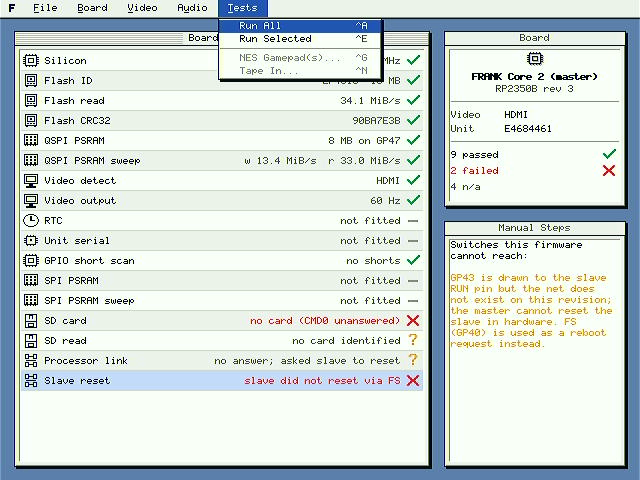
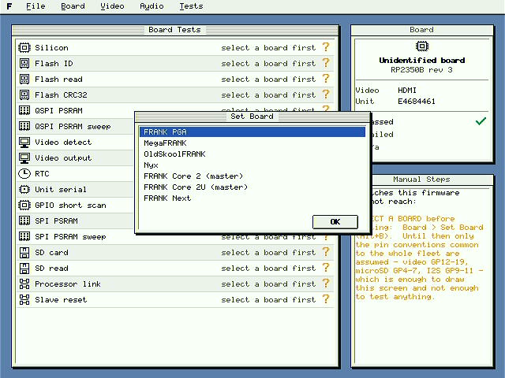
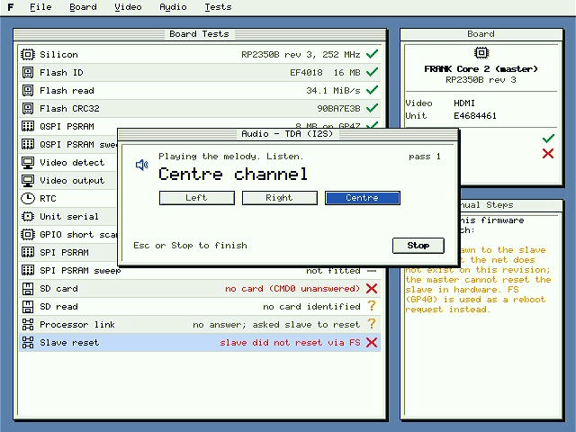

# FRANK Test

Hardware test firmware for the FRANK family of RP2350 retro-computer boards. One
image works out which board it is running on, figures out what that board
actually has, and tests only that.



---

## Contents

- [What it is](#what-it-is)
- [Supported boards](#supported-boards)
- [Getting started](#getting-started)
- [The interface](#the-interface)
- [Board detection](#board-detection)
- [Video](#video)
- [The tests](#the-tests)
- [Interactive checks](#interactive-checks)
- [What it cannot test](#what-it-cannot-test)
- [Building](#building)
- [Releases](#releases)
- [Repository layout](#repository-layout)
- [Contributing](#contributing)
- [Attribution](#attribution)
- [Licence](#licence)

---

## What it is

FRANK boards all follow the Murmulator pin conventions, but they differ in
silicon, memory, connectors and audio. Keeping a separate test firmware for each
one meant a dozen nearly identical images, and they drifted apart.

This is one image for all of them. It identifies the board and says how sure it
is. It gates every test on what that board declares, so a peripheral the board
does not have reports **n/a** instead of failing. It keeps *could not run*
separate from *failed*, because those mean different things to whoever is holding
the board. And it prints what it measured: clock rates, chip IDs, throughput,
capacities. Not just a tick.

The interface is a windowed desktop at 640×480 with HDMI, VGA and composite
output, driven entirely from the keyboard.

---

## Supported boards

| Board | MCU | Notes |
|---|---|---|
| FRANK | RP2350A (Pico 2 socket) | DIP-gated tape input |
| FRANK PGA | PGA2350 module | |
| MegaFRANK | RP2350B | TurboSound, SPI PSRAM, RTC, unit serial |
| miniFRANK | RP2350A | DIP-gated tape input |
| microFRANK | RP2350A | |
| zeroFRANK | RP2350A | |
| OldSkoolFRANK | RP2350A | DB9 gamepads |
| Nyx | RP2350A | No USB host, no PS/2 |
| FRANK Core 2 | RP2350B + RP2350A | Inter-processor link |
| FRANK Core 2U | RP2350B + RP2350A | As Core 2, plus tape and a USB hub |
| FRANK Next | RP2350B | TLV320 codec |

An unidentified board still boots and draws the screen. It assumes only the
conventions the whole fleet shares: video on GP12-19, microSD on GP4-7, I²S on
GP9-11. That is enough to show you an interface and deliberately not enough to
test anything.

---

## Getting started

1. Pick the image for your silicon from the table below.
2. Hold **BOOTSEL**, connect USB, and drop the `.uf2` onto the drive that
   appears.
3. Connect a display. HDMI is the default; see [Video](#video) for the others.
4. Attach a USB or PS/2 keyboard.
5. Press **S** and pick your board.
6. Press **A** to run everything.

### Which image

The test firmware is one program that works out which board it is on at run
time, so the only thing a build has to get right is the **package**. Get it
wrong and it does not misbehave subtly, it hard-faults on the first access to a
GPIO the package does not have.

| Board | Image |
|---|---|
| miniFRANK, microFRANK, zeroFRANK | `rp2350a` |
| MegaFRANK, Nyx, OldSkoolFRANK, FRANK Next | `rp2350b` |
| FRANK PGA | `rp2350b` — a PGA2350 is always the B package |
| FRANK | whichever module is in the socket: a Pico 2 is `rp2350a`, a Pico Plus 2 is `rp2350b` |
| FRANK Core 2, Core 2U — master | `rp2350b` |
| FRANK Core 2, Core 2U — slave | `slave` |

The slave image is a different program: the link peer the master talks to. Flash
it to the second chip of a Core 2 or Core 2U, or "Processor link" and "Slave
reset" will correctly report that nothing answered.

---

## The interface



Everything is reachable from the keyboard. Some boards in this fleet have no
pointing device at all, so that is not a nicety.

| Key | Action |
|---|---|
| `Alt`+`F` `B` `V` `U` `T` | Open the File, Board, Video, Audio or Tests menu |
| arrows | Move within a menu or the test list |
| `Enter` | Activate; on the list, run the selected test |
| `Esc` | Close a menu or dialog |
| `S` | Set Board |
| `A` | Run All |
| `E` | Run Selected |
| `?` | Key help on the console |

A mouse works if you have one. The pointer is drawn by patching the framebuffer
in place rather than recomposing the screen, so it keeps up even while audio is
playing.

Enter BOOTSEL has no keyboard shortcut, on purpose. It is the one command that
ends the session, and a stray keypress used to trigger it.

### Reading the results

| Mark | Meaning |
|---|---|
| ✓ | Passed, with the measurement next to it |
| ✗ | Failed. The board has this hardware and it did not work |
| — | n/a. The board has no such hardware, which is not a defect |
| ? | Could not run. The result is unknown, which is not the same as bad |

The *Manual Steps* panel lists switches and jumpers the firmware cannot reach.
On a board with an audio mux or a tape jumper it can exercise the software half
of the path and not the analogue half. Saying so is the difference between a rig
you can trust and one you cannot.

---

## Board detection

Four tiers, each narrowing the field. The verdict comes with its confidence
attached rather than being presented as fact.

**Silicon.** `SYSINFO_PACKAGE_SEL` separates RP2350A from RP2350B. Chip revision
and unique ID come from the same place, then flash JEDEC ID, then PSRAM presence
and size.

**Inventory.** A DS3231 at 0x68, a TLV320 codec, a DS2401 silicon serial. Each is
on some boards and not others.

**Fingerprint.** Pins get pulled up, released, and classified by how they settle.
Scoring is a *ratio* of pins matched, not a count, so a board with seven
signature pins cannot beat a board with six just by having more of them.

**The operator.** Some boards really are indistinguishable. Core 2 and Core 2U
share a pin map exactly. When two descriptors tie the firmware says so and asks,
instead of picking one and being quietly wrong.



Your choice is not written to flash. A stored answer is invisible, it survives
you changing your mind, and it follows the firmware rather than the board when an
image gets moved. A reset starts again from what the hardware says.

---

## Video

Three backends, all 640×480, chosen at boot or from the Video menu.

| Mode | How | Notes |
|---|---|---|
| HDMI | HSTX, TMDS | Default. `clk_hstx` at 126 MHz |
| VGA | HSTX, raw 8-lane | Same GP12-19 pins through the resistor ladder |
| Composite | PIO software encoder | PAL/NTSC, 320×240 |

Hold **H**, **V**, **C** or **A** (auto) during the two-second window at boot.
Choosing from the Video menu instead reboots, because the boot path is the only
code path that has ever been tested for bringing a backend up.

Nothing about video is written to flash. The menu's request rides a watchdog
scratch register across the reboot that applies it and is consumed there, so a
power cycle always comes back on whatever the board actually has. This is
deliberate: a stored mode outranks detection and lives in a sector `picotool
load` does not erase, so a board told once to use VGA kept coming up VGA no
matter what was flashed onto it afterwards, silently. A deliberate choice is
cheap to repeat; a wrong one that survives reflashing costs an evening.

Composite does not get the desktop, and cannot. A composite line carries
somewhere around 320 usable samples however you arrange the source, and 6-pixel
type resampled to fit stops being type. It renders its own text page instead: 42
columns by 30 rows at native resolution, same information, actually legible.

Menu items enable only when the board has the connector *and* this firmware has a
backend for it. An enabled control that quietly falls back to something else is
worse than a greyed-out one.

---

## The tests

### Silicon and memory

| Test | What it proves | What it does not |
|---|---|---|
| Silicon | MCU class, revision, unique ID, system clock | |
| Flash ID | JEDEC manufacturer and device ID, capacity | Anything about the contents |
| Flash read | Sustained XIP read throughput | |
| Flash CRC32 | A CRC over the image, so you can tell what is loaded | |
| QSPI PSRAM | The chip answers on its chip select, and its size | |
| QSPI PSRAM sweep | Write and verify across the whole part | |
| SPI PSRAM | MegaFRANK's second, bit-banged PSRAM: manufacturer ID | Needs S10 closed |
| SPI PSRAM sweep | One block per 64 KiB, seeded from the address | |

The memory benchmarks run before video starts. HSTX scanout fights XIP for the
same bus, and measuring afterwards understated flash throughput by a factor of
four. That number looked like a hardware fault for a while.

Each sweep block is seeded from its own address, so a block read back from the
wrong place fails instead of matching by luck. That is what catches a dropped
address line.

### Board peripherals

| Test | What it proves |
|---|---|
| Video detect | Which output the detector chose, and why |
| Video output | Frames are being emitted, by counting them |
| RTC | A DS3231 acknowledges at 0x68 |
| Unit serial | The DS2401 ROM, the only per-unit identity here that is not a guess |
| GPIO short scan | Adjacent-pin solder bridges |

The short scan skips pins that are tied together on purpose. The link buses run
adjacent pins to the same places by design, GP9-11 are joined by the audio
network, and driving the link's control lines resets the slave. Flagging those
every run would just teach you to ignore the result.

### Storage

| Test | What it proves |
|---|---|
| SD card | CMD0/CMD8/ACMD41 succeed, and CID and CSD decode to manufacturer, product and capacity |
| SD read | Sector 0 comes back carrying a boot signature |

Two rows, because they fail for different reasons. Sixteen bytes of CID can
succeed over a link that falls apart at 512. An unformatted card reports *could
not run* rather than failing, since that is not a board fault.

### Inter-processor link (Core 2 / Core 2U)

| Test | What it proves |
|---|---|
| Processor link | Handshake, then bidirectional throughput. Typically around 96 MiB/s duplex |
| Slave reset | The master can reboot the slave over FS and watch it come back |

Both need the slave image running. The link stack escalates recovery on its own:
an FS request every second failure, a reset pulse every fourth. A slave that boots
late or gets reflashed has to be noticed rather than forced into step.

---

## Interactive checks

Some things cannot be tested by a machine with no way to observe the result.
Nothing on a FRANK board can hear its own audio or read back a write-only shift
register, so a PASS in the results list would be a claim the firmware has no
business making. These are dialogs you drive yourself.

### Audio, `Alt`+`U`



PWM, TDA (I²S) and TurboSound. Each loops a short melody through left, right and
centre, naming the channel while it plays. One steady tone cannot tell a working
stereo path from a stuck LRCK. They all sound like success.

On a board with an audio mux the dialog tells you which switch positions that
source needs. The mux is a 4:1 selector rather than two enables, so setting both
switches picks ground. That is silence, and it looks exactly like a dead
amplifier.

### NES gamepads, `Tests` ▸ `NES Gamepad(s)`

Both ports drawn schematically, with each button lighting up as you press it and
named underneath. A row saying "gamepad: PASS" cannot mean anything. A row saying
"0x21" means something to nobody.

### Tape in, `Tests` ▸ `Tape In`

The CD4069 squares the incoming audio into digital edges, and this counts and
times them. The display is a ZX Spectrum loading stripe, which is not decoration:
a Spectrum paints one border band per tape pulse, so band thickness *is* pulse
length. Thick red and cyan bands mean pilot tone. Thin blue and yellow mean data.
A picture that stops moving means nothing is arriving. You do not have to read a
number to see any of that.

---

## What it cannot test

Worth being blunt about, because a rig that quietly claims coverage it does not
have is worse than one that owns up.

Anything past an audio pin. There is no loopback and no ADC. The firmware can
prove SCLK and LRCK are clocking and nothing whatsoever about the DAC, the
amplifier or the speaker.

The AY chips. That 74HC595 chain is write-only.

Whether a display is plugged in. No FRANK board wires hot-plug detect, so an
absent monitor and a broken output look identical. *Video output* counts emitted
frames and claims nothing more.

Switch positions. Every board has switches the firmware cannot read, and they are
listed in *Manual Steps*.

Composite lock. The encoder can be shown to run. Whether a television syncs to it
is something only a television can tell you.

Fourteen of the thirty-one capability bits are tested today.
[docs/ROADMAP.md](docs/ROADMAP.md) goes through the rest: what a test could
honestly prove, what it could not, and a sensible order to do them in.

---

## Building

You need the [Pico SDK](https://github.com/raspberrypi/pico-sdk) 2.x and the Arm
GNU toolchain. `sdk_env.sh` finds the SDK, and rejects a stale `PICO_SDK_PATH`
instead of trusting it.

```sh
make build                    # default board (frank_core2_master)
make build BOARD=frank_core2u_master
make flash                    # hold BOOTSEL first
```

Or without make:

```sh
cmake -S app -B app/build -DPICO_BOARD=frank_core2_master
cmake --build app/build -j8
```

### Console

The build is a USB HID host so that keyboards and mice can be tested, and the
RP2350's single USB controller cannot be a CDC device at the same time. So the
console is UART at 115200. For bring-up work, `-DUI_INPUT_USB_HID=OFF` trades the
host for a USB serial console.

On every board with a PS/2 port the mouse sits on GP0/GP1, which is UART0, so the
two cannot both exist. The mouse wins by default: testing that connector is why
it is on the board. Either of these keeps the console instead, and both leave the
PS/2 mouse uninitialised.

| Way | Scope |
|---|---|
| Hold **U** during the boot window | This boot only. Combines with a video key — hold both |
| `File` ▸ `Serial Console` | Stored in flash, so it survives a reflash. Takes effect on the next boot |

The menu item is stored rather than applied on the spot, because the pins are
claimed once during start-up and there is no safe way to hand them back to a UART
underneath a running PS/2 state machine. It is ticked when the console is being
kept.

---

## Releases

`version.txt` holds `MAJOR MINOR` and everything reads it. CMake stamps the
banner and the About box from it, and `release.sh` writes it before building, so
a binary cannot disagree with its own filename.

```sh
./release.sh 1.00
```

That puts two files in `release/`:

- `frank-test_1_00_master.uf2`, the test firmware
- `frank-test_1_00_slave.uf2`, the link peer for Core 2 and Core 2U

---

## Repository layout

```
app/          the test firmware executable and its CMake
core/         board table, capabilities, detection, settings, registry
ui/           4 bpp drawing, windows, menus, icons, video backends
tests/        one file per subsystem under test
common/       the inter-processor link stack, shared with the core2 firmware
drivers/      vendored hardware drivers (see Attribution)
boards/       Pico SDK board headers for each FRANK variant
slave/        the link peer firmware
screenshots/  captured over HDMI from real hardware
```

`master/`, `probe/` and `selftest/` came along from the frank_core2 firmware this
was branched from. Only `master/src/ui_font.c` is still used.

---

## Contributing

```sh
make hooks    # point git at .githooks
```

This repository's history names the people responsible for it and nobody else.
Commit messages that credit an AI, whether a co-author trailer, a "generated
with" advertisement or a session link, get rejected by the `commit-msg` hook
locally and by the `Attribution` job in CI for everyone else. The local hook only
protects a clone that opted in, and it never runs for a commit made through
GitHub's web interface, so CI is what actually enforces this.

---

## Attribution

This firmware leans on a lot of other people's work. Vendored code keeps its
original authorship and licence, and each file carries a provenance note at the
top.

| Component | Source | Author |
|---|---|---|
| Composite PAL/NTSC encoder (`drivers/tv`) | [frank-msx](https://github.com/rh1tech/frank-msx), from murmnes | Mikhail Matveev, after the Murmulator lineage |
| NES/SNES gamepad PIO reader (`drivers/nespad`) | [pico-infonesPlus](https://github.com/fhoedemakers/pico-infonesPlus) | shuichitakano, fhoedemakers (MIT) |
| SD CID/CSD decode and manufacturer table (`tests/tests_sd.c`) | [SpeccyP](https://github.com/billgilbert7000/SpeccyP), `drivers/pico_fatfs/tf_card.c` | Constantin (billgilbert7000) and contributors |
| FatFs (`drivers/fatfs`) | [elm-chan.org](http://elm-chan.org/fsw/ff/) | ChaN (BSD-style) |
| I²S audio PIO (`drivers/audio_i2s.pio`) | Raspberry Pi Pico examples lineage | |
| USB HID host, XInput (`drivers/usbhid`) | TinyUSB and contributors | |
| HSTX VGA register configuration | DispHSTX | Miroslav Nemecek |
| Adjacent-pin short scan | [murmulator-tester](https://github.com/DnCraptor/murmulator-tester) | DnCraptor |
| TurboSound 74HC595 word format | [SpeccyP](https://github.com/billgilbert7000/SpeccyP), `aySoft.h` | Constantin (billgilbert7000) |

The vendored composite driver needed two edits, both because of how this firmware
allocates its hardware rather than out of preference:

- `PIO_VIDEO` selects pio2. pio0 carries the inter-processor link and pio1 the
  I²S audio.
- The DMA request line now comes from `pio_get_dreq()` rather than a hardcoded
  `DREQ_PIO1_TX0`. That constant predates the RP2350's third PIO and silently
  hands pio2 the pio1 request line.

A third change publishes the encoder's emitted-frame count, which gives *Video
output* something honest to measure.

---

## Licence

GPL-3.0-or-later. See [LICENSE](LICENSE).

Copyright © 2026 Mikhail Matveev, <https://rh1.tech>
